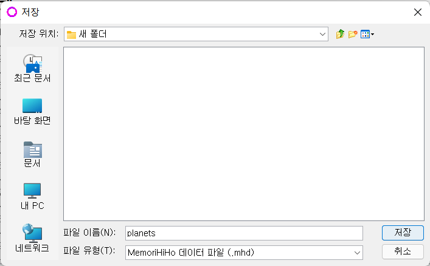
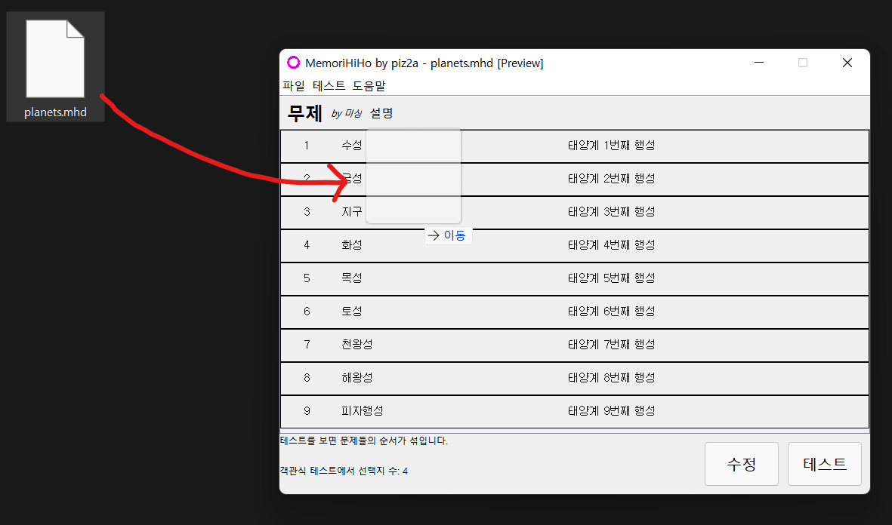

## MemoriHiHo

MemoriHiHo는 단어나 문장을 암기할 때 도움을 주는 프로그램입니다. 
[다운로드 (v0.1 한국어)](https://github.com/piz2a/MemoriHiHo/releases/download/0.1/MemoriHiHo-0.1-Korean.exe)

<h4>첫 화면</h4>

 
프로그램을 켜면 이 화면이 나옵니다. 왼쪽에 문제를, 오른쪽에 답이 쓰여 있어서 이 화면에서 스크롤하면서 암기를 하시면 됩니다. 
"수정" 버튼을 누르면 수정하는 화면으로 이동하며, "테스트" 버튼을 누르면 어떤 테스트를 할지 창이 뜹니다. 

<h4>암기 목록 수정하기</h4>

 
암기할 목록을 수정하는 화면입니다. 
제목, 제작자, 설명을 바꿀 수 있으며, 객관식 테스트를 할 때 선택지의 개수, 테스트를 볼 때 순서를 섞는지 여부를 설정할 수 있습니다. 
각 항목마다 ^(위쪽 화살표), +, X 총 3개의 버튼이 있습니다. 
- ^는 자기 자신 항목과 바로 위쪽 항목의 위치를 뒤바꾸는 버튼입니다. 
- +는 자기 자신보다 바로 아래에 빈 항목을 새로 추가하는 버튼입니다. 
- X는 자기 자신 항목을 제거하는 버튼입니다. 
  

<h4>설정</h4>

  
설정에 들어가면 이 프로그램의 언어를 바꿀 수 있습니다. 현재는 한국어와 영어만 지원합니다. 

<h4>주관식 테스트</h4>

 
문제만을 보고 답을 칸에 써서 맞추는 주관식 테스트입니다. 도중에 취소 버튼을 누르면 테스트가 종료됩니다. 
 
 
확인 버튼을 누르면 채점이 되고 일치하는 글자 수가 점수로 환산됩니다. 
 
테스트가 끝나면 점수, 푼 문제 수, 총 걸린 시간, 한 문제당 걸린 평균 시간을 알려줍니다. 

<h4>객관식 테스트</h4>

 
문제만을 보고 선택지 중에 맞는 것을 고르는 객관식 테스트입니다. 도중에 취소 버튼을 누르면 테스트가 종료됩니다. 
 
확인 버튼을 누르면 채점이 되며, 맞으면 점수를 얻고, 틀리면 얻지 못합니다. 
주관식 테스트와 마찬가지로 테스트가 끝나면 점수, 푼 문제 수, 총 걸린 시간, 한 문제당 걸린 평균 시간을 알려줍니다. 

<h4>거꾸로 주관식 테스트</h4>

 
주관식 테스트와 방법은 똑같으나 답과 문제가 뒤바뀐, 답만 보고 문제를 서술하는 테스트입니다. 

<h4>거꾸로 객관식 테스트</h4>

 
객관식 테스트와 방법은 똑같으나 답과 문제가 뒤바뀐, 답만 보고 문제를 고르는 테스트입니다. 

<h4>저장, 열기 및 공유</h4>

 
만든 단어장은 파일로 저장하고 언제든지 다시 열 수 있습니다. 
 
파일 확장자는 .mhd입니다. 
 
또한 파일을 프로그램으로 드래그 앤 드롭하는 것으로도 열 수 있습니다. 

